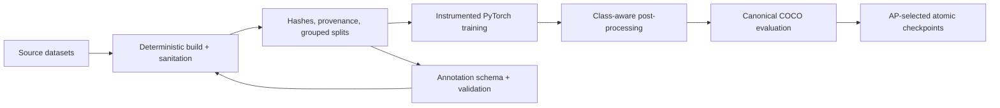

# AgriNav — Rice/Weed Perception ML Engineering

AgriNav is a computer-vision research project for identifying protected rice and target weeds in field imagery. I built the data, training, evaluation, and quality-control infrastructure needed to turn an exploratory model into a measurable ML system.

This recruiter-focused repository is intentionally scoped to **perception engineering**. It does not contain navigation, spraying, actuator control, datasets, or model weights.

## At a glance

| | |
|---|---|
| Goal | Produce reviewable rice/weed detections while failing closed on ambiguous evidence |
| My work | Dataset engineering, PyTorch model/training code, evaluation, experiment design, debugging instrumentation, CI, and safety boundaries |
| Stack | Python 3.11+, PyTorch, TorchVision, Transformers, OpenCV, COCO/pycocotools, JSON Schema, GitHub Actions |
| Current stage | Research pipeline validated; full detector comparison and external-field validation remain open |
| Source snapshot | Public `Autonomous-tractor-system` repository, commit `ed93be5` |

## Selected outcomes

| Outcome | Measured result |
|---|---:|
| Rebuilt the detector dataset from source truth | **2,579 images / 81,201 valid boxes** |
| Corrected image-orientation and annotation integrity | 214 EXIF-normalized images, 115 boxes clipped, 3 invalid boxes rejected, 0 duplicate image hashes |
| Closed the RiceSEG pretraining phase reproducibly | Best mIoU **0.5827**, reproduced within **0.001 mIoU** |
| Found an optimizer failure hidden by falling loss | `grad_clip=0.5` truncated **100% of steps** in both pilot arms |
| Demonstrated the impact under a matched overfit-8 test | AP50 **0.0064 → 0.3331**, a **52× increase**, by removing the clipping bottleneck |
| Passed the decoded overfit gate | AP **0.5224**, AP50 **0.8750**, AR@100 **0.6315**, train/eval confidence ratio **1.01** |
| Built an honest detector evaluation path | Class-aware decode, per-class NMS, inverse letterbox, COCO adapter, AP-based checkpoint selection |
| Expanded automated correctness coverage | Project record: **308 tests plus 16 subtests passing** |

The most important success was diagnostic, not cosmetic. Training loss had been falling while the model barely learned because every optimizer step was clipped. I added gradient-distribution, positive/negative loss, and train-vs-eval BatchNorm instrumentation; used a controlled two-arm pilot to isolate the failure; and then proved the correction through decoded AP rather than loss alone.

## System design



## What is in this portfolio

- `src/agrinav/data/` — deterministic dataset builders, conversion tools, audits, and annotation validation.
- `src/agrinav/training/` — segmentation pretraining, detector training, pilot reporting, and maintained-model controls.
- `src/agrinav/inference/postprocess.py` — the shared class-aware decode and NMS path.
- `src/agrinav/evaluation/` — model-to-COCO conversion and metric handling.
- `tests/` — unit, integration, regression, and synthetic vision-pipeline tests.
- `configs/` — path-free, versioned experiment configurations.
- `docs/PORTFOLIO_RESULTS.md` — metric provenance and honest claim boundaries.

## Five-minute technical walkthrough

1. Read [`PROJECT_CASE_STUDY.md`](PROJECT_CASE_STUDY.md) for the decisions and outcomes.
2. Review [`docs/PORTFOLIO_RESULTS.md`](docs/PORTFOLIO_RESULTS.md) for evidence and limitations.
3. Inspect [`src/agrinav/data/build_rice_phase2.py`](src/agrinav/data/build_rice_phase2.py) for the fail-closed dataset rebuild.
4. Inspect [`src/agrinav/training/weeddet_train.py`](src/agrinav/training/weeddet_train.py) and [`src/agrinav/training/pilot_report.py`](src/agrinav/training/pilot_report.py) for training instrumentation and decision logic.
5. Inspect [`src/agrinav/inference/postprocess.py`](src/agrinav/inference/postprocess.py), [`src/agrinav/evaluation/runner.py`](src/agrinav/evaluation/runner.py), and their tests for the canonical evaluation path.

## Run locally

```bash
python -m venv .venv
source .venv/bin/activate          # Windows: .venv\Scripts\activate
python -m pip install -e ".[dev]"
pytest
```

Useful commands:

```bash
agrinav --help
python -m agrinav.training.riceseg_pretrain --self-test
ruff check .
black --check .
```

## Honest status

- The decoded overfit result is a pipeline correctness gate, not a generalization score.
- A corrected full detector run and same-protocol maintained baselines are still required before making a headline detector-accuracy claim.
- The dataset lacks farm, season, device, and capture-condition metadata, so same-dataset results cannot establish field generalization.
- Historical detector metrics and contaminated checkpoints are intentionally excluded from the success story.
- No model output is treatment permission. Unknown, invalid, stale, or out-of-distribution evidence remains nonactionable.

## Author

Benjamin Merryman-Smith<br>
FGCU Whitaker College of Engineering · CEN 4930, Spring 2026
