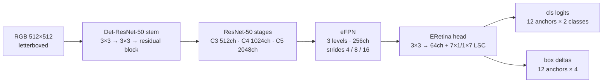
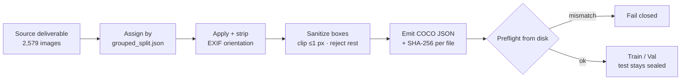

# AgriNav Perception — Technical Deep Dive

A rice/weed detector for an autonomous paddy tractor, plus the data, training, and
evaluation infrastructure needed to tell whether its numbers can be trusted.

Curated from [`Bmerrysmith/Autonomous-tractor-system`](https://github.com/Bmerrysmith/Autonomous-tractor-system)
at commit `ed93be5`. Perception only: no datasets, weights, navigation, or
treatment/actuation logic are included.

**Contents:** [Problem](#the-problem) · [Model](#model-architecture) · [Data](#dataset-engineering) ·
[Training](#training-and-instrumentation) · [Evaluation](#post-processing-and-evaluation) ·
[Results](#results) · [Conclusions so far](#conclusions-so-far) · [Claim boundaries](#claim-boundaries) ·
[Running it](#running-it)

---

## The problem

The detector outputs two classes: `rice_protect` (never spray) and `weed_target`
(candidate for treatment). The data makes this harder than a typical detection
benchmark:

| Property (train split, after 512 px letterbox) | Value |
|---|---:|
| Boxes that are COCO-small (< 32² px) | 56.0% |
| Boxes with a minimum side under 16 px | 32.6% |
| Median box | 20.8 × 41.7 px |
| Median annotated objects per image | 31 |
| Rice-to-weed instance ratio | 6.78 : 1 |

Small, tall, densely packed plants of a majority class sit next to a minority
class that matters most. Those properties drove almost every design decision
below.

## Model architecture

WeedDet follows Peng et al. (2022), *Weed Detection in Paddy Field Using an
Improved RetinaNet Network* (Computers and Electronics in Agriculture, 199).



| Component | What it does | Why |
|---|---|---|
| **Det-ResNet-50 stem** | Two 3×3 convs (16ch) and a stride-2 residual block (16→32ch) replace the 7×7 conv and max-pool | Keeps one extra 2× of resolution, so the FPN levels land on strides 4/8/16 (P2–P4) instead of 8/16/32 |
| **eFPN** | 1×1 lateral convs, nearest-neighbor top-down fusion, 3×3 output convs, 256ch | Three levels are enough because objects are small; no P5–P7 |
| **ERetina head** | Shared 3×3 conv down to 64ch, then a depthwise 7×1 → 1×7 → pointwise large-separable conv | Large receptive field for tall plants at a fraction of RetinaNet's 4× 256ch conv tower. Classifier bias is initialized to a prior of 0.01 |
| **Anchors** | Base scale 3 × stride, aspect ratios {0.2, 0.33, 0.5, 1.0}, 3 scales per octave: 12 per location, 5.4–170 px | Rice is tall and thin. The [anchor audit](reports/metrics/anchor_audit_rice_train.json) found mean best-anchor IoU 0.735, with only 0.48% of 56,499 training boxes below 0.5 IoU. The weak spot is the 207 wide boxes (w/h ≥ 2), half of which fall below 0.5 |
| **Assignment** | ATSS: take the top-9 nearest *cells* per level, set the IoU threshold to mean + std over candidates, require anchor centers inside the GT box, then guarantee one positive per GT | Adapts the threshold per object. Fixed 0.5/0.4 thresholds starve small boxes |
| **Regression loss** | SmoothL1 on encoded deltas + CIoU on decoded boxes | CIoU's aspect-ratio term helps on tall boxes |
| **Classification loss** | Focal-style BCE with hard positive targets | Deliberately *not* called VariFocal. See [defects](#correctness-defects-found-and-fixed) |

The backbone loads 288 of 342 ImageNet tensors. The custom stem and the first
bottleneck of `layer1` have different shapes, so they start from random init.
That detail matters in the [architecture control](#architecture-control-is-weed-accuracy-data-limited-or-model-limited).

## Dataset engineering



**What was wrong.** The archive two earlier training runs used was built from
Roboflow's native folders, ignoring the grouped split shipped next to it. I checked
it file by file:

| Intended split | Exported as train | Exported as valid |
|---|---:|---:|
| train | 1,261 | 351 |
| valid | 358 | 115 |
| **test** | **179** | **52** |

That puts 940 of 2,316 files in the wrong split and 231 of 261 sealed test images
in training. On top of that, 214 source images carry EXIF orientation 8, which means
the pixels are rotated 90° relative to their boxes. Roboflow's native split also
shares video-frame families across train, valid, and test, which inflates
validation scores.

**What [`build_rice_phase2.py`](src/agrinav/data/build_rice_phase2.py) does:**

- assigns every image from the manifest, never from folder names
- applies the EXIF orientation and strips the tag, so pixels and boxes agree
- clips boxes that overshoot the image by ≤ 1 px (115 boxes) and rejects larger violations into a report (3 boxes) instead of dropping them silently
- writes a SHA-256 hash for every emitted image and JSON, and rejects cross-split duplicates and stray files
- re-opens everything from disk in `preflight` and fails on any membership, hash, dimension, or count mismatch

| Split | Images | Boxes | rice_protect | weed_target |
|---|---:|---:|---:|---:|
| Train | 1,800 | 59,691 | 52,194 | 7,497 |
| Validation | 518 | 15,226 | 13,201 | 2,025 |
| Test (sealed) | 261 | 6,284 | 5,355 | 929 |
| **Total** | **2,579** | **81,201** | **70,750** | **10,451** |

**What it deliberately doesn't do.** It doesn't invent a new test split. Of the 781
images never trained on, only 6 sit in a fully clean capture group, and those 6
contain zero weeds. The manifest's test split is still valid for any model trained
from scratch on this build; only the contaminated checkpoints may never be scored
on it. Full details are in the [dataset card](docs/rice_phase2_dataset_card.md).

## Training and instrumentation

**Recipe** ([`detector_rice_phase2.yaml`](configs/training/detector_rice_phase2.yaml)):
SGD (lr 1e-3, momentum 0.9, weight decay 1e-4), linear warmup into cosine decay to
1e-5, batch 8, AMP, EMA of weights (decay 0.999), 18 epochs, label-aligned
geometric and photometric augmentation. The backbone warm-starts from either
ImageNet or the RiceSEG-pretrained backbone with a single CLI flag.

**What the trainer records** each epoch in `metrics.jsonl`:

- gradient-norm p50 / p90 / p99 / max and the fraction of steps clipped
- the positive and negative halves of the classification loss, read from the same tensor the gradient uses. With tens of thousands of negative anchors per image, a falling total can just mean the model learned to say "background" everywhere.
- BatchNorm state as observed (not as requested), plus a train-vs-eval confidence parity ratio. An earlier run showed a ~47× gap: 0.94 peak confidence under batch statistics vs. ~0.02 under running statistics.
- `status.json` and checkpoints written atomically, with resume support. The periodic checkpoint cadence (`18 % 4 ≠ 0`) had made four *completed* runs look like crashes at epoch 16.

[`pilot_report.py`](src/agrinav/training/pilot_report.py) reads that file and
answers the questions a 2-epoch pilot exists to settle before booking an 18-epoch
GPU run: what `grad_clip` should be, whether the BN gap is opening, whether the
classifier is learning objects, and whether the BN freeze actually held.

**The gradient-clip finding.** Every unthrottled measurement the project recorded:

| Regime | p50 | p90 | p99 | max |
|---|---:|---:|---:|---:|
| overfit-8, batch 2, random init | 4.436 | 6.770 | 40.949 | 77.745 |
| overfit-16, batch 2, random init | 3.804 | 5.060 | 23.908 | 69.106 |
| phase-2 RiceSEG arm, batch 8, AMP | 5.377 | 6.872 | 10.538 | 13.996 |
| phase-2 ImageNet arm, batch 8, AMP | 8.207 | 18.079 | 32.907 | 39.667 |

With `grad_clip=0.5`, the clip bound on 100% of steps in every run. It shrank the
median step 10–16× and the tail up to 80×, so the clip was setting the step size,
not the learning-rate schedule. The new value is 100, chosen on purpose:

- **Not the observed max (39.7):** that came from 2 epochs, and a clip sitting at the max starts binding silently as soon as a later epoch is noisier.
- **Not the RiceSEG arm's p99 (10.5):** that would clip ~1% of RiceSEG steps but ~25% of ImageNet steps, which turns the clip into a confound in exactly the comparison the pilot exists to make.

## Post-processing and evaluation

[`postprocess.py`](src/agrinav/inference/postprocess.py) is the single decode path
shared by training validation, offline evaluation, and the baseline harness
([ADR 0003](docs/adr/0003-one-canonical-detection-postprocessor.md)).

| Before | After | Why it matters here |
|---|---|---|
| One class per anchor (`sigmoid().max()`) | Every (anchor, class) pair above 0.05 is a candidate | An anchor firing on rice *and* weed kept only its stronger class |
| One class-agnostic NMS pass | NMS / Soft-NMS within a class, never across classes | Overlapping rice and weed are the normal case in a paddy, and a rice box could delete a weed box |
| Global pre-NMS top-k | Per-class top-k (2,000) | At 6.8:1, rice candidates filled a global cap and evicted above-threshold weeds |
| Ad-hoc un-padding | Exact inverse letterbox, clip in original pixels, drop boxes that exist only in padding | Coordinates must agree with COCO ground truth |

[`evaluation/runner.py`](src/agrinav/evaluation/runner.py) converts predictions to
COCO format with an explicit category map and scores them with pycocotools at the
standard `maxDets=100`. It is tested end to end: a stub model that returns exact
ground truth scores AP 1.0, and shifted boxes or a swapped class map lower the score.
With `val_ap_interval: 2`, validation AP of the EMA weights selects the best checkpoint.

### Correctness defects found and fixed

| Defect | Symptom | Fix | Test |
|---|---|---|---|
| ATSS top-k chose the 9 nearest *anchors*, and all 12 shapes at a cell share a center | The "neighborhood" could be 9 shapes at one cell, which breaks ATSS's mean + std threshold | Select top-k distinct *cells* per level, then take every shape at them | `test_atss_candidates_span_distinct_cells` |
| `pos[gt_best_anchor] = True` with advanced indexing | When two GTs shared a best anchor, one silently got no positive | Strongest GT claims the anchor; the other falls back to its next-best unclaimed anchor | `test_colliding_best_anchor_does_not_orphan_a_gt` |
| An IoU ignore band [0.4, pos) in ATSS mode | Unsupervised anchors saturated to score 1.00 under hard targets, flooding false positives | All non-positives are negatives (ATSS paper semantics) | old behavior kept behind `atss_all_neg` for ablation |
| Classifier target set to IoU(predicted box, GT) | At cold start predicted IoU ≈ 0, so positive targets ≈ 0 and the classifier collapsed | Reverted: positives now use hard targets, and the loss is renamed honestly because it is not VariFocal Loss and does not train IoU-aware scores | predicted-IoU target kept behind `vfl_use_pred_iou` for ablation |
| Translation augmentation | Labels could detach from boxes when one box clipped away | Move content, boxes, and labels together | `test_labels_follow_boxes_when_one_is_clipped_away` |
| Class-agnostic decode (table above) | Rice suppressed weeds | Class-aware canonical post-processor | `test_postprocess.py` |

## Results

### Phase 1: RiceSEG backbone pretraining

The backbone is pretrained ImageNet → RiceSEG (3,078 tiles from 5 countries,
group-aware split by source photo) as a feature initializer for the detector.

| Class | IoU at best epoch | Last-5-epoch mean |
|---|---:|---:|
| background / green_veg | 0.87 / 0.87 | 0.87 / 0.87 |
| panicle | 0.74 | 0.74 |
| senescent | 0.35 | 0.348 |
| duckweed | 0.36 | 0.356 |
| **weeds** | **0.32** | **0.278 ± 0.026** |
| **mIoU** | **0.5827** | 0.5769 |

An independent run with the same split, seed, and recipe landed at 0.5816: within
0.001 mIoU. Validation had been flat since epoch 19 while training loss kept
falling, and the LR had annealed to ~3e-6. That made it a reproducible ceiling, not
an undertrained run, so I closed the phase instead of re-running at ~160 epochs.

**Bug found in the segmentation overfit gate.** The gate first reported
"FAILED: mIoU 0.62, pipeline broken." Both halves of that verdict were wrong:

1. The stratified subset appended the only duckweed tile and then truncated the list back to 8, dropping it. With duckweed absent, `np.nanmean` divided by 5 or 6 depending on the epoch. Two epochs with *identical* per-class IoUs reported 0.62 and 0.50.
2. The gate had a floor on epochs, not steps. 8 tiles at batch 4 meant just 120 optimizer steps.

After fixing both, the gate passed at 0.8631 (threshold 0.80 kept, not lowered).

### Architecture control: is weed accuracy data-limited or model-limited?

Weed IoU was low and unstable. The two explanations lead to opposite fixes: annotate
more weeds, or change the model. [`baseline_seg_control.py`](src/agrinav/training/baseline_seg_control.py)
trains stock segmenters on the identical split, loss, seed, schedule, and
metric, imported from the pretraining module rather than reimplemented. Only the
model varies.

| Model | Stable mIoU | **Stable weed IoU** (last 5 epochs) |
|---|---:|---:|
| Custom Det-ResNet-50 | 0.566 ± 0.009 | **0.202 ± 0.053** |
| DeepLabV3-ResNet50 | 0.615 ± 0.002 | **0.483 ± 0.006** |
| SegFormer-B2 | 0.645 ± 0.001 | **0.522 ± 0.002** |

Both stock models beat the custom backbone on weeds by 5–6× its noise band, and
their weed IoU barely moves between epochs. The oscillation was a property of the
architecture, not of the task. Senescent and duckweed sit near 0.36 for DeepLabV3
too, which points to a data ceiling for those classes.

**Limits:** backbone and decoder are not isolated, one seed per model, a batch-size
confound (12 vs. 8), and segmentation is a proxy for detection.

### Phase 2: detector diagnostic pilot (2 epochs per arm)

| Measurement | RiceSEG warm start | ImageNet warm start |
|---|---:|---:|
| Steps clipped at 0.5 | 100% | 100% |
| Positive classification-loss reduction | 50.8% | 26.0% |
| Train/eval confidence parity | 0.84 → 0.88 | 0.71 → 0.75 |

Parity stayed inside the preregistered [0.33, 3.00] band, so BatchNorm was a symptom
to watch, not the cause. A checkpoint-breaking GroupNorm rewrite was not justified.

### Decoded overfit gate

Matched comparison (8 images, 60 epochs, same seed and data):

| `grad_clip` | AP | AP50 | AR@100 | Clipped steps |
|---:|---:|---:|---:|---:|
| 0.5 | 0.0012 | 0.0064 | 0.0286 | 100% |
| 120 | 0.0628 | 0.3331 | 0.2563 | 0% |

Correctly sized gate (16 images, 150 epochs): **AP 0.5224, AP50 0.8750,
AR@100 0.6315**, confidence ratio 1.01, loss 4.568 → 0.231, 0% clipped steps.

Machine-readable values: [`docs/evidence/results_summary.json`](docs/evidence/results_summary.json).

## Conclusions so far

1. **The failures that looked like "the model can't learn" were measurement and pipeline defects.** A leaked split, rotated labels, class-agnostic suppression, broken ATSS neighborhoods, orphaned ground truth, and a clip that bound every step each independently corrupt a result. With them fixed, data, optimization, decoding, and evaluation work together: AP50 0.875 on the overfit gate. That establishes correctness, not accuracy.
2. **Loss and proxies are not evidence. Decoded AP is.** Loss fell while AP50 was 0.006, and a segmentation gate "failed" only because its own denominator was changing. Every selection and comparison now runs through the canonical decode and pycocotools.
3. **The weed bottleneck is the backbone first and the data second.** Under a controlled comparison, stock ResNet-50 and SegFormer models reach about 2.4–2.6× the custom backbone's stable weed IoU at a small fraction of its variance. This reverses the project's earlier "we need more weed data" assumption. The lowest-risk next change is a standard torchvision ResNet-50, which loads 342/342 ImageNet tensors and produces the same C3/C4/C5 the FPN needs, keeping the eFPN/ATSS head. Before committing, rerun with 2 more seeds and matched batch size.
4. **Senescent and duckweed are data-limited.** They plateau near 0.35 IoU for both architectures, so new real minority examples are the lever there, not loss or learning-rate changes.
5. **RiceSEG warm start is directionally positive but unproven for detection.** It cut positive classification loss 50.8% vs. ImageNet's 26.0%, with a tighter gradient distribution. It is still a 2-epoch, single-seed signal. Whether it improves detector AP is the question the 18-epoch A/B answers.
6. **Evidence before claims.** The project is at "pipeline validated, accuracy unmeasured." Remaining work:
   1. the corrected 18-epoch run
   2. a maintained baseline (Faster R-CNN / RetinaNet / FCOS) under the same protocol
   3. multiple seeds
   4. an independent farm/season/camera evaluation set
   5. a resolution or tiled-inference study, since a third of boxes are under 16 px

## Claim boundaries

- The overfit gates prove pipeline correctness; they are not generalization scores.
- The warm-start comparison is 2 epochs and one seed.
- No maintained detector baseline has finished under the current protocol, so there is no headline architecture or accuracy claim.
- No independent farm or season data has been evaluated. The dataset lacks farm, season, and device metadata.
- Historical runs trained on the contaminated archive, and their checkpoints, are excluded.
- Detector output is never treatment permission. Missing, uncertain, stale, or out-of-distribution evidence means no treatment. The earlier "spray everything that isn't rice" inference script was disabled for exactly this reason ([inference/README.md](src/agrinav/inference/README.md)).

## Running it

From this directory:

```bash
python -m venv .venv
source .venv/bin/activate          # Windows: .venv\Scripts\activate
python -m pip install -e ".[dev]"
pytest
```

No data or GPU is needed for the tests. Useful entry points:

```bash
agrinav --help
python -m agrinav.training.weeddet_train --self-test
python -m agrinav.training.riceseg_pretrain --self-test
```

The [training quickstart](docs/TRAINING_QUICKSTART.md) shows a full detector training
command, and the [baseline protocol](docs/baselines.md) shows how the maintained-model
comparison is run.
